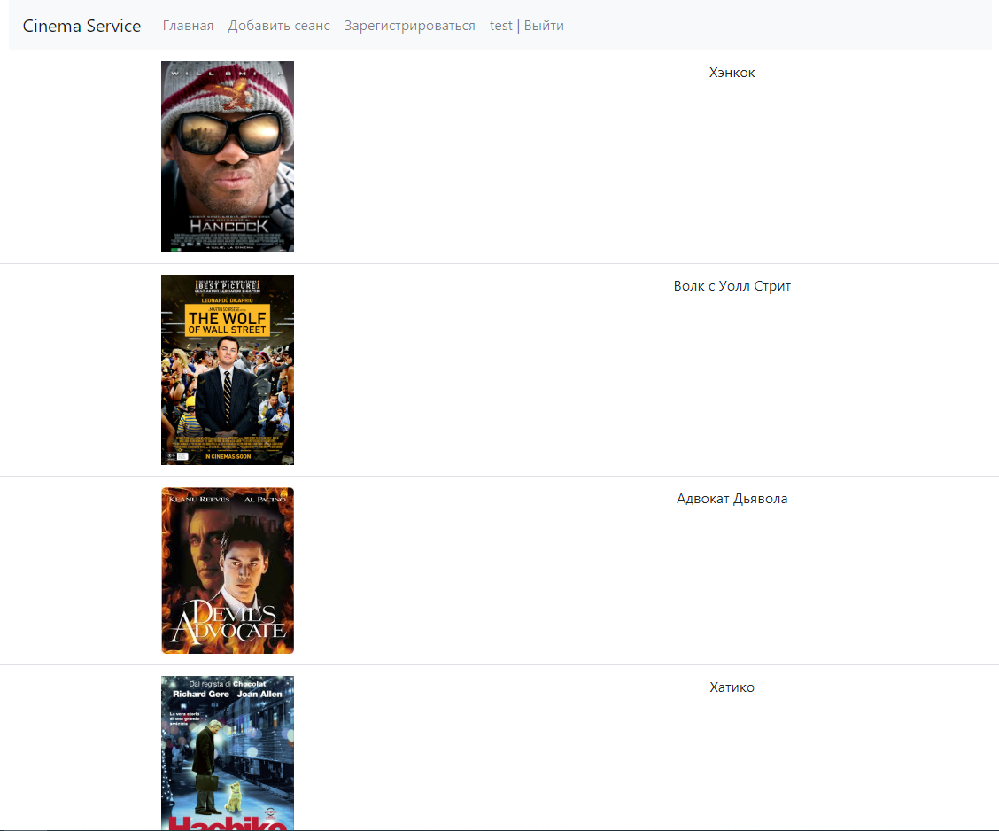
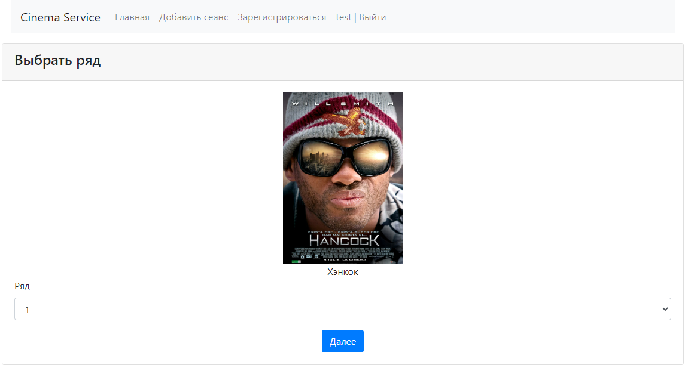
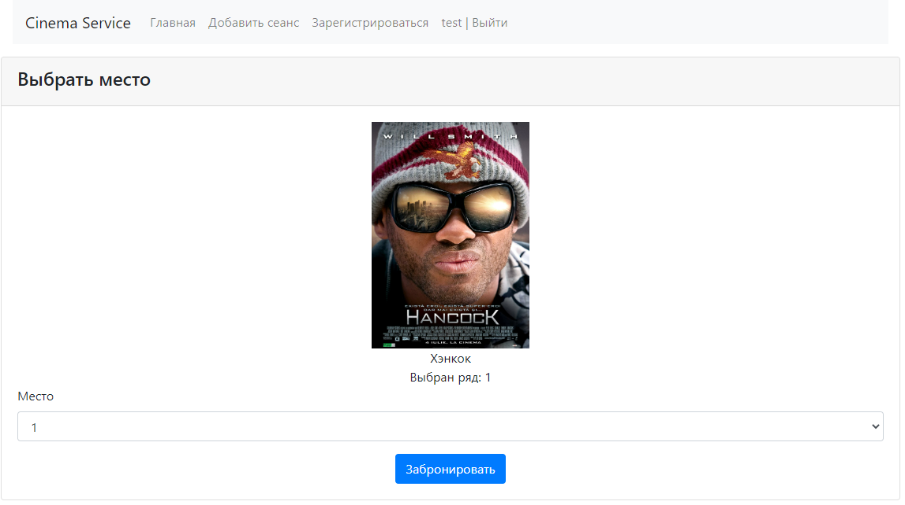
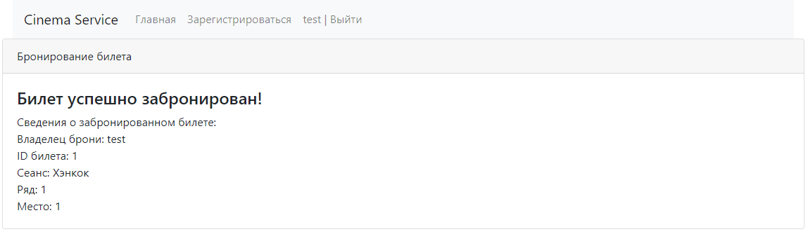
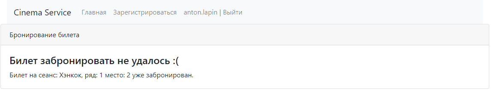
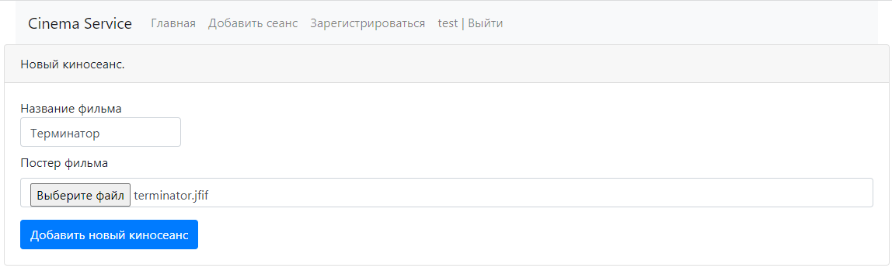
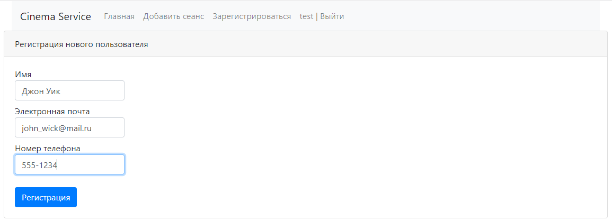
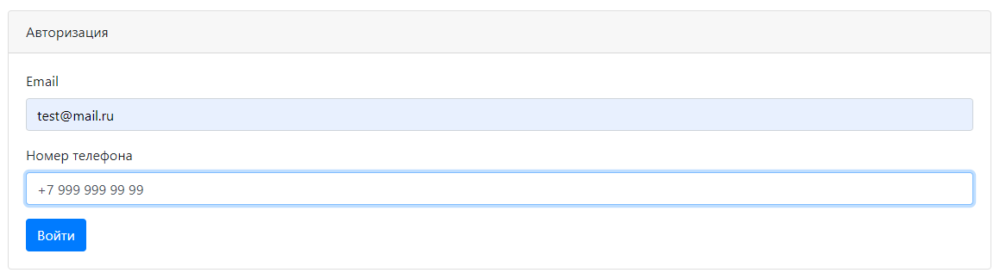

# job4j_cinema

### Cайт бронирования билетов в кинотеатр

---
##### Главная страница, форма с выбором фильма

##### Форма выбора ряда

##### Форма выбора места

##### Сообщение об успешном бронировании билета

##### Сообщение о том, что билет был уже забронирован другим пользователем

##### Форма для добавления нового фильма

##### Форма для регистрации нового пользователя

##### Форма для авторизации

---
### Используемый стек
- Java 17
- Apache Maven 3.8.5 
- Spring Boot 2.7.3
- PostgreSQL 13
- Liquibase 3.6.2
- Thymeleaf

---
### Требуемое окружение
- JDK 17
- Apache Maven 3.8.5
- PostgreSQL 13
- Браузер

---
### Подготовка к запуску приложения
- Создать БД cinema хост `jdbc:postgresql://localhost:5432/cinema`
- Собрать jar с приложением, выполнив команду `mvn install`
- Запустить приложение, выполнив команду: `java -jar job4j_cinema`
- Перейти в браузере по ссылке `http://localhost:8080/index`